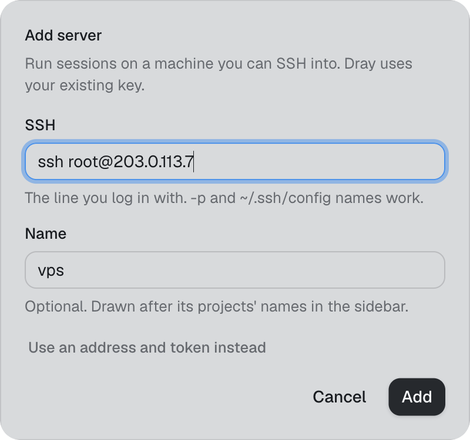
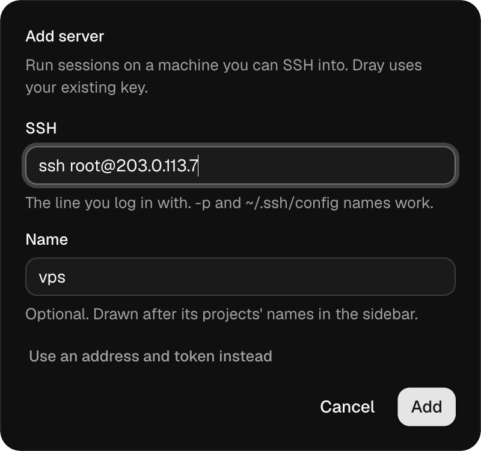
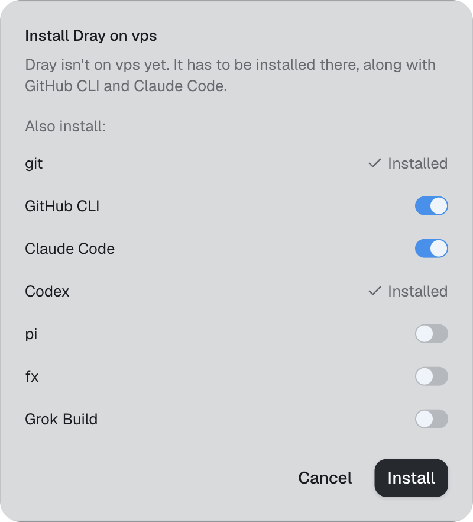
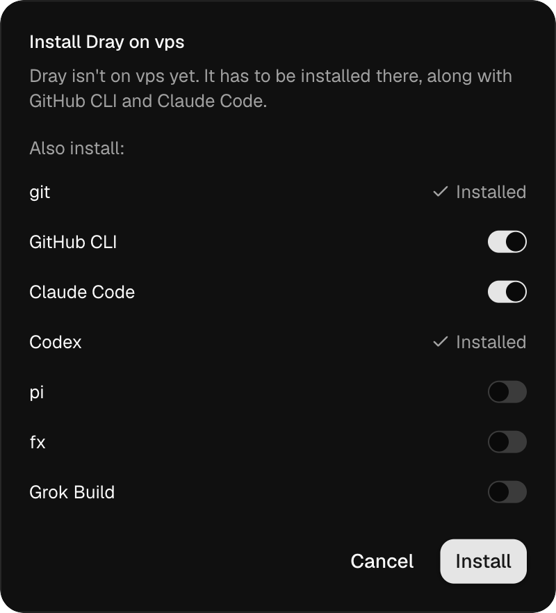
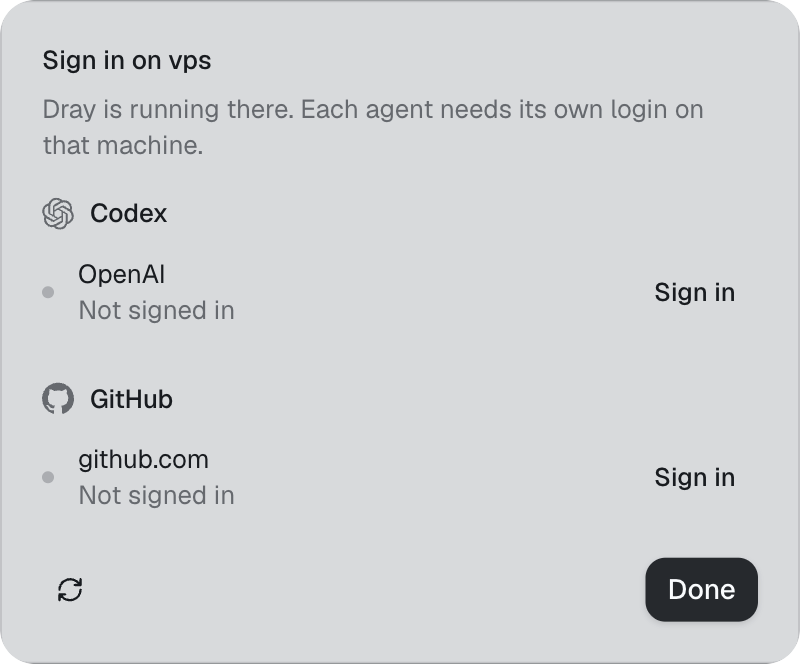
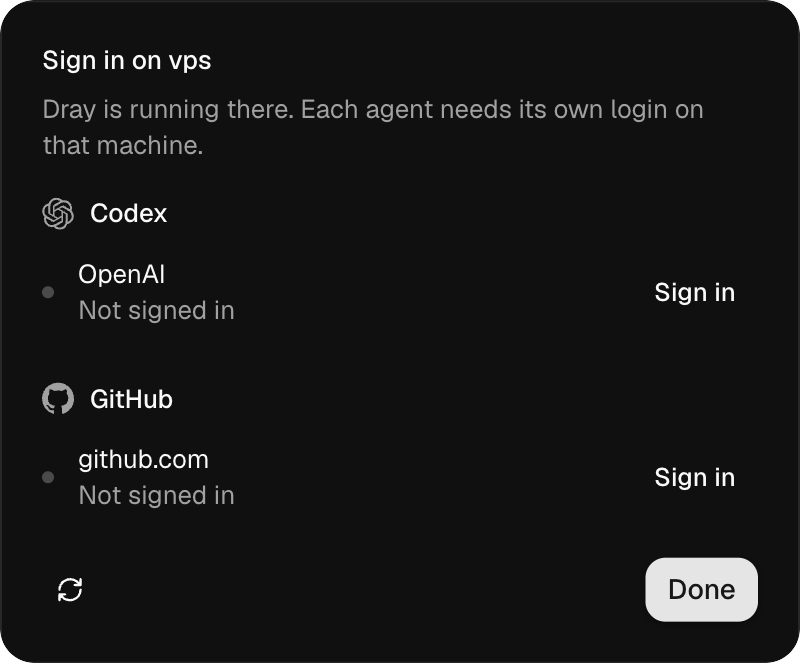
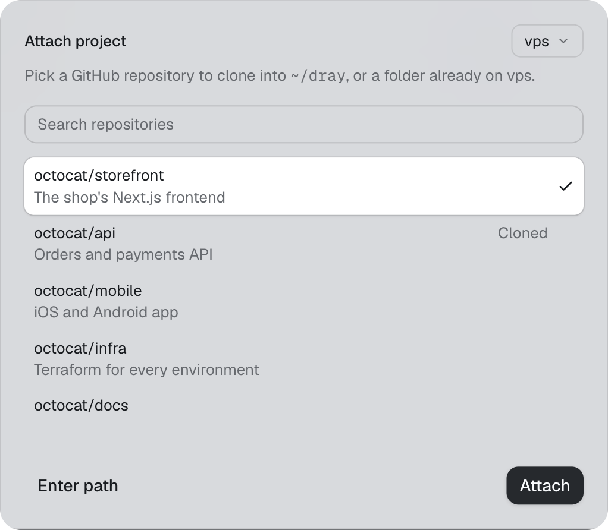
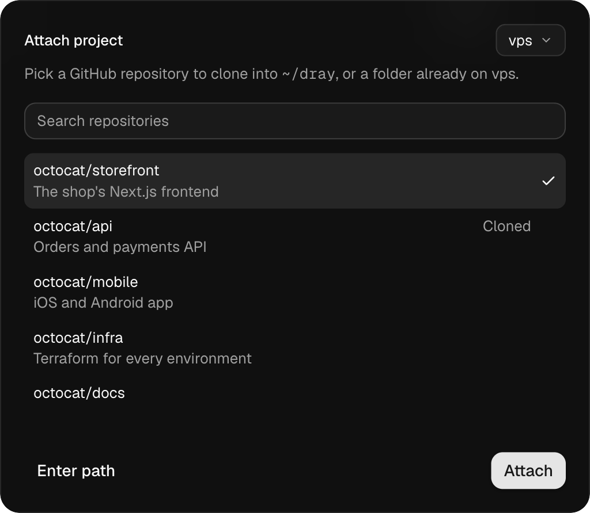

All you need is a Linux server you can reach over SSH with a key. The Mac app does the rest.

<Steps>
  <Step title="Add the server">
    In the Mac app, open Settings → Servers → Add server and paste the SSH line, like `ssh root@1.2.3.4`.

    <Frame>
      
      
    </Frame>

    The app connects with your Mac's own `ssh`. No port is opened, no password is stored, and Dray never sees your key. If SSH asks for a password, the app shows the `ssh-copy-id` line that sets up a key.
  </Step>
  <Step title="Install Dray there">
    If Dray is not on the server yet, the app offers to install it. Pick what else to install: Claude Code, Codex, pi, fx and Grok Build, plus git, the GitHub CLI, ffmpeg and a browser for your agents.

    <Frame>
      
      
    </Frame>

    Dray runs as a systemd user service, so it keeps running after you log out and comes back after a reboot. That needs linger on your user; if setup cannot turn it on, it says so, and `sudo loginctl enable-linger <user>` fixes it. If Dray is installed but stopped, the app starts it.
  </Step>
  <Step title="Sign in">
    Each agent needs its own login on the server, and so does `gh`. Once Dray is running there, the app shows that server's accounts, the same list as Settings → Accounts. Sign in opens Terminal on the server, running that login.

    <Frame>
      
      
    </Frame>
  </Step>
  <Step title="Attach a project">
    Attach a project, pick the server, and choose one of your GitHub repos, read through `gh` on that server. Dray clones it to `~/dray/<repo>` there. A path to a folder already on the server works too.

    <Frame>
      
      
    </Frame>

    Then start a session like any other.
  </Step>
</Steps>

## Install from the server instead

If you would rather install by hand, log in to the server and run:

```bash
curl -fsSL https://www.drayhq.com/install.sh | sh
```

This installs `dray` and `dray-serve` into `~/.local/bin`, then `dray setup` asks the same questions as the app and starts the service. It ends by printing the SSH line to paste into Add server.

## What works today

- Linux on x86_64 and arm64.
- You use it through the Mac app. There is no browser version and no phone app yet.
- A Mac cannot be a server yet.
